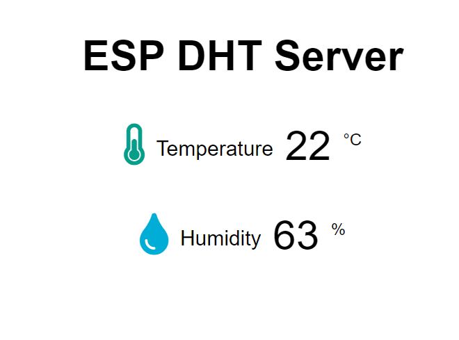

# Micropython-small-projects
This is my small project for esp8266 NodeMCU.

## Introduction

1.(`WiFi.py`) is for your NodeMCU to connect to the Internet

2.(`webapp.py`) is a simple websocket server with a single page web application.

>(Actually, the MicrowebSrv2 and Picoweb web framework is most useful for esp8266, but my board's storage is not enough for them.)

3.(`main.py`) is a example for connect your NodeMCU to adafruit.io by MQTT. You can use it to communicate with your board by remote control
